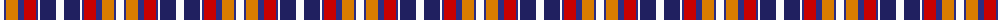

The parent of this is [Wombles 2 (Corporate)](/tartans/w/8/db2/o12/db6/r12/db2/w2/dba16/w/8/)

This was sourced from tartans-authority.  It is a [9 stripes tartan](/stripes/stripes9/).

Original link http://www.tartansauthority.com/tartan-ferret/display/1772/

## Thread count
W/8 DB2 O12 DB6 R12 DB2 W2 DBa16 W/8

## Palette
Each colour and its ΔE from the base-6 reference it is a variant of.

| Colour | Shade | Base | ΔE (OKLab) |
|---|---|---|---|
| DB |  `#2C2C80` | B  | 0.05 |
| DBa |  `#202060` | B  | 0.11 |
| O |  `#D87C00` | Y  | 0.17 |
| R |  `#C80000` | R  | 0.00 |
| W |  `#FCFCFC` | W  | 0.03 |

ID: /variants/w/8/db2/o12/db6/r12/db2/w2/dba16/w/8-db2c2c80-dba202060-od87c00-rc80000-wfcfcfc/
