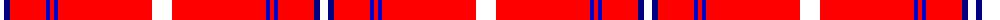
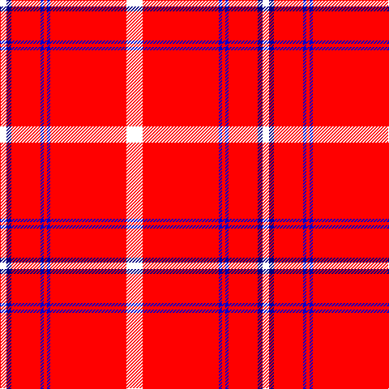

The parent of this is [Swiss National](/tartans/w/8/db6/r36/b4/r4/b4/r94/w/20/)

This was sourced from register-of-tartans.  It is a [8 stripes tartan](/stripes/stripes8/).

Original link https://www.tartanregister.gov.uk/tartanDetails.aspx?ref=10491

## Thread count
W/8 DB6 R36 B4 R4 B4 R94 W/20

## Palette
Each colour and its ΔE from the base-6 reference it is a variant of.

| Colour | Shade | Base | ΔE (OKLab) |
|---|---|---|---|
| B |  `#0000CD` | B  | 0.15 |
| DB |  `#000080` | B  | 0.14 |
| R |  `#FF0000` | R  | 0.11 |
| W |  `#FFFFFF` | W  | 0.03 |

# Sample pattern

ID: /variants/w/8/db6/r36/b4/r4/b4/r94/w/20-b0000cd-db000080-rff0000-wffffff/
