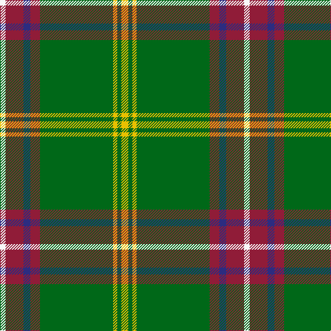

The parent of this is [Hall (P.I.E.) (Personal)](/tartans/w/8/dr26/db10/dr14/g106/y6/g6/y/10/)

This was sourced from tartans-authority.  It is a [8 stripes tartan](/stripes/stripes8/).

Original link http://www.tartansauthority.com/tartan-ferret/display/2619/

## Thread count
W/8 DR26 DB10 DR14 G106 Y6 G6 Y/10

## Palette
Each colour and its ΔE from the base-6 reference it is a variant of.

| Colour | Shade | Base | ΔE (OKLab) |
|---|---|---|---|
| DB |  `#2C2C80` | B  | 0.05 |
| DR |  `#901C38` | R  | 0.12 |
| G |  `#006818` | G  | 0.02 |
| W |  `#F8F8F8` | W  | 0.01 |
| Y |  `#E8C000` | Y  | 0.00 |

# Sample pattern

ID: /variants/w/8/dr26/db10/dr14/g106/y6/g6/y/10-db2c2c80-dr901c38-g006818-wf8f8f8-ye8c000/
