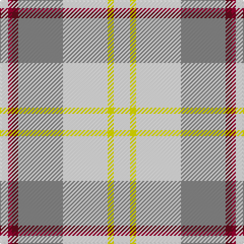

The parent of this is [Banff, White (Fashion)](/tartans/w/8/dr4/dra6/n44/w44/y6/w/16/)

This was sourced from tartans-authority.  It is a [7 stripes tartan](/stripes/stripes7/).

Original link http://www.tartansauthority.com/tartan-ferret/display/3646/

## Thread count
W/8 DR4 DRa6 N44 W44 Y6 W/16

## Palette
Each colour and its ΔE from the base-6 reference it is a variant of.

| Colour | Shade | Base | ΔE (OKLab) |
|---|---|---|---|
| DR |  `#9C0030` | R  | 0.10 |
| DRa |  `#640C1C` | B  | 0.20 |
| N |  `#888888` | R  | 0.24 |
| W |  `#FCFCFC` | W  | 0.03 |
| Y |  `#FCFC00` | Y  | 0.16 |

# Sample pattern

ID: /variants/w/8/dr4/dra6/n44/w44/y6/w/16-dr9c0030-dra640c1c-n888888-wfcfcfc-yfcfc00/
