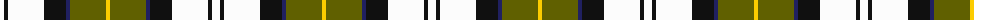

The parent of this is [Barbour - Ancient](/tartans/w/8/k4/w36/k22/db4/t36/y/4/)

This was sourced from tartans-authority.  It is a [7 stripes tartan](/stripes/stripes7/).

Original link http://www.tartansauthority.com/tartan-ferret/display/8733/

## Thread count
W/8 K4 W36 K22 DB4 T36 Y/4

## Palette
Each colour and its ΔE from the base-6 reference it is a variant of.

| Colour | Shade | Base | ΔE (OKLab) |
|---|---|---|---|
| DB |  `#202060` | B  | 0.11 |
| K |  `#101010` | K  | 0.17 |
| T |  `#606000` | G  | 0.09 |
| W |  `#FCFCFC` | W  | 0.03 |
| Y |  `#FCCC00` | Y  | 0.04 |

# Sample pattern

ID: /variants/w/8/k4/w36/k22/db4/t36/y/4-db202060-k101010-t606000-wfcfcfc-yfccc00/
