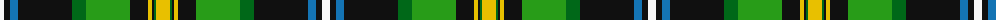

The parent of this is [Gilhooley (Name)](/tartans/w/8/k6/b8/k54/ga14/g44/k18/y4/k2/ga2/y/14/)

This was sourced from tartans-authority.  It is a [11 stripes tartan](/stripes/stripes11/).

Original link http://www.tartansauthority.com/tartan-ferret/display/6700/

## Thread count
W/8 K6 B8 K54 Ga14 G44 K18 Y4 K2 Ga2 Y/14

## Palette
Each colour and its ΔE from the base-6 reference it is a variant of.

| Colour | Shade | Base | ΔE (OKLab) |
|---|---|---|---|
| B |  `#1474B4` | B  | 0.15 |
| G |  `#289C18` | G  | 0.18 |
| Ga |  `#006818` | G  | 0.02 |
| K |  `#101010` | K  | 0.17 |
| W |  `#F8F8F8` | W  | 0.01 |
| Y |  `#E8C000` | Y  | 0.00 |

ID: /variants/w/8/k6/b8/k54/ga14/g44/k18/y4/k2/ga2/y/14-b1474b4-g289c18-ga006818-k101010-wf8f8f8-ye8c000/
