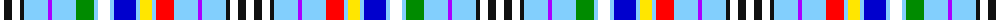

The parent of this is [Liberty, Egal'ty, Fratern'ty and Progress Blue Lodge](/tartans/w/8/k8/w8/k4/lb24/p4/lb24/g18/lb4/w12/lb4/b22/lb4/y12/lb4/r18/lb24/p4/lb24/k4/w8/k8/w/8/)

This was sourced from register-of-tartans.  It is a [23 stripes tartan](/stripes/stripes23/).

Original link https://www.tartanregister.gov.uk/tartanDetails.aspx?ref=10242

## Thread count
W/8 K8 W8 K4 LB24 P4 LB24 G18 LB4 W12 LB4 B22 LB4 Y12 LB4 R18 LB24 P4 LB24 K4 W8 K8 W/8

## Palette
Each colour and its ΔE from the base-6 reference it is a variant of.

| Colour | Shade | Base | ΔE (OKLab) |
|---|---|---|---|
| B |  `#0000CD` | B  | 0.15 |
| G |  `#008B00` | G  | 0.12 |
| K |  `#101010` | K  | 0.17 |
| LB |  `#82CFFD` | W  | 0.18 |
| P |  `#AA00FF` | B  | 0.29 |
| R |  `#FF0000` | R  | 0.11 |
| W |  `#FFFFFF` | W  | 0.03 |
| Y |  `#FFE600` | Y  | 0.10 |

ID: /variants/w/8/k8/w8/k4/lb24/p4/lb24/g18/lb4/w12/lb4/b22/lb4/y12/lb4/r18/lb24/p4/lb24/k4/w8/k8/w/8-b0000cd-g008b00-k101010-lb82cffd-paa00ff-rff0000-wffffff-yffe600/
