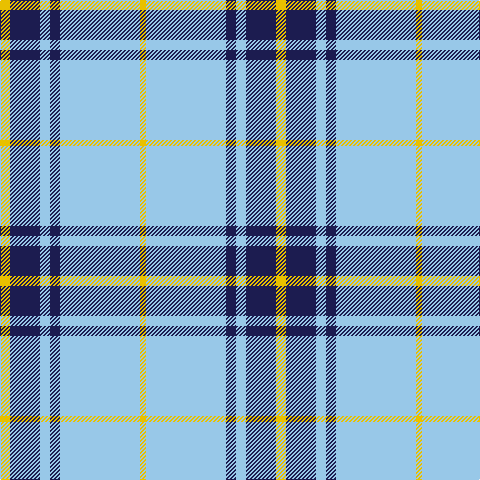

The parent of this is [Legary (Name)](/tartans/y/10/db30/lb10/db10/lb80/y/6/)

This was sourced from tartans-authority.  It is a [6 stripes tartan](/stripes/stripes6/).

Original link http://www.tartansauthority.com/tartan-ferret/display/10041/

## Thread count
Y/10 DB30 LB10 DB10 LB80 Y/6

## Palette
Each colour and its ΔE from the base-6 reference it is a variant of.

| Colour | Shade | Base | ΔE (OKLab) |
|---|---|---|---|
| DB |  `#1C1C50` | B  | 0.14 |
| LB |  `#98C8E8` | W  | 0.17 |
| Y |  `#E8C000` | Y  | 0.00 |

# Sample pattern

ID: /variants/y/10/db30/lb10/db10/lb80/y/6-db1c1c50-lb98c8e8-ye8c000/
