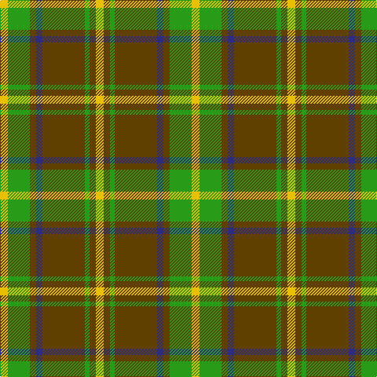

The parent of this is [Invertere (Daks #2) (Fashion)](/tartans/y/10/g28/t8/db8/t54/g6/t8/y/10/)

This was sourced from tartans-authority.  It is a [8 stripes tartan](/stripes/stripes8/).

Original link http://www.tartansauthority.com/tartan-ferret/display/1882/

## Thread count
Y/10 G28 T8 DB8 T54 G6 T8 Y/10

## Palette
Each colour and its ΔE from the base-6 reference it is a variant of.

| Colour | Shade | Base | ΔE (OKLab) |
|---|---|---|---|
| DB |  `#2C2C80` | B  | 0.05 |
| G |  `#289C18` | G  | 0.18 |
| T |  `#604000` | G  | 0.14 |
| Y |  `#E8C000` | Y  | 0.00 |

# Sample pattern

ID: /variants/y/10/g28/t8/db8/t54/g6/t8/y/10-db2c2c80-g289c18-t604000-ye8c000/
