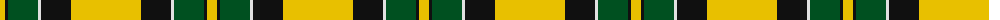

The parent of this is [Jacobite #2](/tartans/y/10/k3/g30/ln3/k30/y/70/)

This was sourced from register-of-tartans.  It is a [6 stripes tartan](/stripes/stripes6/).

Original link https://www.tartanregister.gov.uk/tartanDetails.aspx?ref=1874

## Thread count
Y/10 K3 G30 LN3 K30 Y/70

## Palette
Each colour and its ΔE from the base-6 reference it is a variant of.

| Colour | Shade | Base | ΔE (OKLab) |
|---|---|---|---|
| G |  `#005020` | G  | 0.08 |
| K |  `#101010` | K  | 0.17 |
| LN |  `#E0E0E0` | W  | 0.06 |
| Y |  `#E8C000` | Y  | 0.00 |

# Sample pattern

ID: /variants/y/10/k3/g30/ln3/k30/y/70-g005020-k101010-lne0e0e0-ye8c000/
