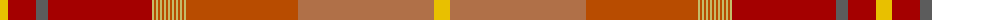

The parent of this is [Lehbrink No. 1 (Fashion)](/tartans/y/16/dr28/n12/dr104/lg2/do2/lg2/do2/lg2/do2/lg2/do2/lg2/do2/lg2/do2/lg2/do2/lg2/do2/lg2/do112/lt136/y/16/)

This was sourced from tartans-authority.  It is a [24 stripes tartan](/stripes/stripes24/).

Original link http://www.tartansauthority.com/tartan-ferret/display/8240/

## Thread count
Y/16 DR28 N12 DR104 LG2 DO2 LG2 DO2 LG2 DO2 LG2 DO2 LG2 DO2 LG2 DO2 LG2 DO2 LG2 DO2 LG2 DO112 LT136 Y/16

## Palette
Each colour and its ΔE from the base-6 reference it is a variant of.

| Colour | Shade | Base | ΔE (OKLab) |
|---|---|---|---|
| DO |  `#B84C00` | R  | 0.08 |
| DR |  `#A40000` | R  | 0.08 |
| LG |  `#C4BC68` | Y  | 0.07 |
| LT |  `#B07048` | R  | 0.15 |
| N |  `#5C5C5C` | B  | 0.14 |
| Y |  `#E8C000` | Y  | 0.00 |

ID: /variants/y/16/dr28/n12/dr104/lg2/do2/lg2/do2/lg2/do2/lg2/do2/lg2/do2/lg2/do2/lg2/do2/lg2/do2/lg2/do112/lt136/y/16-dob84c00-dra40000-lgc4bc68-ltb07048-n5c5c5c-ye8c000/
