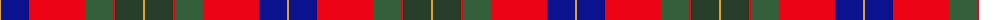

The parent of this is [Abernethy (Colerain, USA)](/tartans/y/2/db28/r56/n28/r2/dn28/y/2/)

This was sourced from register-of-tartans.  It is a [7 stripes tartan](/stripes/stripes7/).

Original link https://www.tartanregister.gov.uk/tartanDetails.aspx?ref=10333

## Thread count
Y/2 DB28 R56 N28 R2 DN28 Y/2

## Palette
Each colour and its ΔE from the base-6 reference it is a variant of.

| Colour | Shade | Base | ΔE (OKLab) |
|---|---|---|---|
| DB |  `#0B148E` | B  | 0.11 |
| DN |  `#273F2A` | G  | 0.14 |
| N |  `#355F3B` | G  | 0.07 |
| R |  `#EC0416` | R  | 0.08 |
| Y |  `#E0A126` | Y  | 0.08 |

# Sample pattern

ID: /variants/y/2/db28/r56/n28/r2/dn28/y/2-db0b148e-dn273f2a-n355f3b-rec0416-ye0a126/
