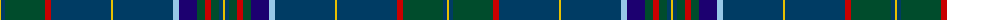

The parent of this is [Benteau na mara (Name)](/tartans/y/2/dba4/g40/r6/dba60/y2/dba60/lb6/db18/g8/r6/g8/dba4/y/2/)

This was sourced from tartans-authority.  It is a [14 stripes tartan](/stripes/stripes14/).

Original link http://www.tartansauthority.com/tartan-ferret/display/7676/

## Thread count
Y/2 DBa4 G40 R6 DBa60 Y2 DBa60 LB6 DB18 G8 R6 G8 DBa4 Y/2

## Palette
Each colour and its ΔE from the base-6 reference it is a variant of.

| Colour | Shade | Base | ΔE (OKLab) |
|---|---|---|---|
| DB |  `#1C0070` | B  | 0.14 |
| DBa |  `#003C64` | B  | 0.07 |
| G |  `#004C2C` | G  | 0.10 |
| LB |  `#98C8E8` | W  | 0.17 |
| R |  `#C80000` | R  | 0.00 |
| Y |  `#E8C000` | Y  | 0.00 |

ID: /variants/y/2/dba4/g40/r6/dba60/y2/dba60/lb6/db18/g8/r6/g8/dba4/y/2-db1c0070-dba003c64-g004c2c-lb98c8e8-rc80000-ye8c000/
