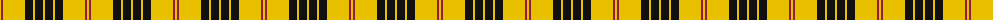
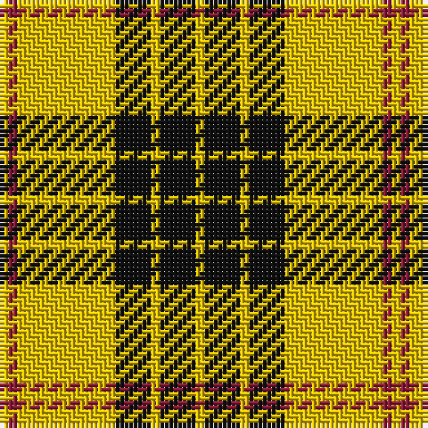

The parent of this is [Baileville (Personal)](/tartans/y/2/dr2/y22/k8/y2/k8/y/2/)

This was sourced from tartans-authority.  It is a [7 stripes tartan](/stripes/stripes7/).

Original link http://www.tartansauthority.com/tartan-ferret/display/2326/

## Thread count
Y/2 DR2 Y22 K8 Y2 K8 Y/2

## Palette
Each colour and its ΔE from the base-6 reference it is a variant of.

| Colour | Shade | Base | ΔE (OKLab) |
|---|---|---|---|
| DR |  `#901C38` | R  | 0.12 |
| K |  `#101010` | K  | 0.17 |
| Y |  `#E8C000` | Y  | 0.00 |

# Sample pattern

ID: /variants/y/2/dr2/y22/k8/y2/k8/y/2-dr901c38-k101010-ye8c000/
