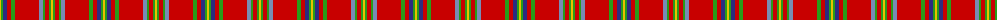

The parent of this is [West Virginia Old Shawl (Artefact)](/tartans/y/2/g2/db4/r4/g4/r24/b4/g2/r4/g2/y/2/)

This was sourced from tartans-authority.  It is a [11 stripes tartan](/stripes/stripes11/).

Original link http://www.tartansauthority.com/tartan-ferret/display/4252/

## Thread count
Y/2 G2 DB4 R4 G4 R24 B4 G2 R4 G2 Y/2

## Palette
Each colour and its ΔE from the base-6 reference it is a variant of.

| Colour | Shade | Base | ΔE (OKLab) |
|---|---|---|---|
| B |  `#788CB4` | B  | 0.25 |
| DB |  `#2C2C80` | B  | 0.05 |
| G |  `#289C18` | G  | 0.18 |
| R |  `#C80000` | R  | 0.00 |
| Y |  `#E8C000` | Y  | 0.00 |

ID: /variants/y/2/g2/db4/r4/g4/r24/b4/g2/r4/g2/y/2-b788cb4-db2c2c80-g289c18-rc80000-ye8c000/
