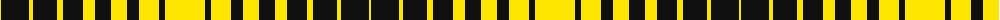

The parent of this is [Yamaguchi Tsutomu](/tartans/y/2/k28/y4/k24/y6/k20/y12/k16/y16/k12/y20/k6/y/40/)

This was sourced from register-of-tartans.  It is a [13 stripes tartan](/stripes/stripes13/).

Original link https://www.tartanregister.gov.uk/tartanDetails.aspx?ref=10622

## Thread count
Y/2 K28 Y4 K24 Y6 K20 Y12 K16 Y16 K12 Y20 K6 Y/40

## Palette
Each colour and its ΔE from the base-6 reference it is a variant of.

| Colour | Shade | Base | ΔE (OKLab) |
|---|---|---|---|
| K |  `#101010` | K  | 0.17 |
| Y |  `#FFE600` | Y  | 0.10 |

ID: /variants/y/2/k28/y4/k24/y6/k20/y12/k16/y16/k12/y20/k6/y/40-k101010-yffe600/
