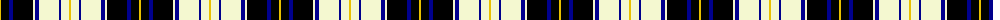

The parent of this is [Chieftain](/tartans/y/2/k8/db4/k20/ly2/db4/ly20/db2/ly8/y/2/)

This was sourced from register-of-tartans.  It is a [10 stripes tartan](/stripes/stripes10/).

Original link https://www.tartanregister.gov.uk/tartanDetails.aspx?ref=630

## Thread count
Y/2 K8 DB4 K20 LY2 DB4 LY20 DB2 LY8 Y/2

## Palette
Each colour and its ΔE from the base-6 reference it is a variant of.

| Colour | Shade | Base | ΔE (OKLab) |
|---|---|---|---|
| DB |  `#00008C` | B  | 0.13 |
| K |  `#000000` | K  | 0.00 |
| LY |  `#F4F8D0` | W  | 0.05 |
| Y |  `#E8C000` | Y  | 0.00 |

ID: /variants/y/2/k8/db4/k20/ly2/db4/ly20/db2/ly8/y/2-db00008c-k000000-lyf4f8d0-ye8c000/
