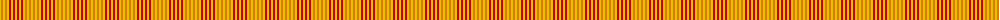

The parent of this is [Compaq Corporate Tartan Tartan Number: 1888. Earliest known date: 1987 Used in the uniforms of Games Officials. See products available Copyright © Blair Urquhart, Comrie, 2015](/tartans/y/2/o2/y2/o2/y2/r2/y2/r2/y/2/)

This was sourced from house-of-tartan.  It is a [9 stripes tartan](/stripes/stripes9/).

Original link http://www.house-of-tartan.scotland.net/house/TartanViewjs.asp?colr=Def&tnam=1888

## Thread count
Y/2 O2 Y2 O2 Y2 R2 Y2 R2 Y/2

## Palette
Each colour and its ΔE from the base-6 reference it is a variant of.

| Colour | Shade | Base | ΔE (OKLab) |
|---|---|---|---|
| O |  `#D87C00` | Y  | 0.17 |
| R |  `#C80000` | R  | 0.00 |
| Y |  `#E8C000` | Y  | 0.00 |

ID: /variants/y/2/o2/y2/o2/y2/r2/y2/r2/y/2-od87c00-rc80000-ye8c000/
