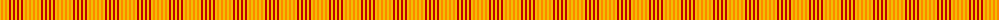

The parent of this is [Compaq](/tartans/y/2/o2/y2/o2/y2/r2/y2/r2/y/2/)

This was sourced from weddslist.  It is a [9 stripes tartan](/stripes/stripes9/).

Original link http://www.weddslist.com/cgi-bin/tartans/pg.pl?source=sts

## Thread count
Y/2 O2 Y2 O2 Y2 R2 Y2 R2 Y/2

## Palette
Each colour and its ΔE from the base-6 reference it is a variant of.

| Colour | Shade | Base | ΔE (OKLab) |
|---|---|---|---|
| O |  `#FF8500` | Y  | 0.14 |
| R |  `#C00000` | R  | 0.02 |
| Y |  `#F0C000` | Y  | 0.01 |

ID: /variants/y/2/o2/y2/o2/y2/r2/y2/r2/y/2-off8500-rc00000-yf0c000/
