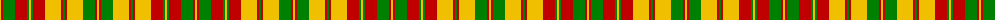

The parent of this is [Strathearn](/tartans/y/2/r2/g12/r12/g2/y2/g2/r12/y16/r2/g2/r2/y16/g12/r2/y/2/)

This was sourced from weddslist.  It is a [16 stripes tartan](/stripes/stripes16/).

Original link http://www.weddslist.com/cgi-bin/tartans/pg.pl?source=sts

## Thread count
Y/2 R2 G12 R12 G2 Y2 G2 R12 Y16 R2 G2 R2 Y16 G12 R2 Y/2

## Palette
Each colour and its ΔE from the base-6 reference it is a variant of.

| Colour | Shade | Base | ΔE (OKLab) |
|---|---|---|---|
| G |  `#008000` | G  | 0.09 |
| R |  `#C00000` | R  | 0.02 |
| Y |  `#F0C000` | Y  | 0.01 |

ID: /variants/y/2/r2/g12/r12/g2/y2/g2/r12/y16/r2/g2/r2/y16/g12/r2/y/2-g008000-rc00000-yf0c000/
