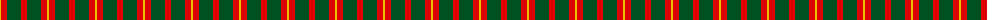
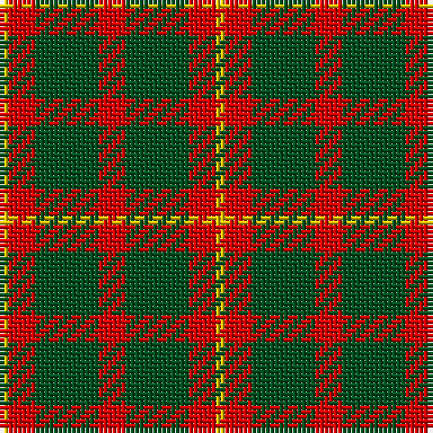

The parent of this is [Unidentified #42](/tartans/y/2/r6/g14/r6/g14/r6/y/2/)

This was sourced from register-of-tartans.  It is a [7 stripes tartan](/stripes/stripes7/).

Original link https://www.tartanregister.gov.uk/tartanDetails.aspx?ref=4243

## Thread count
Y/2 R6 G14 R6 G14 R6 Y/2

## Palette
Each colour and its ΔE from the base-6 reference it is a variant of.

| Colour | Shade | Base | ΔE (OKLab) |
|---|---|---|---|
| G |  `#005020` | G  | 0.08 |
| R |  `#DC0000` | R  | 0.04 |
| Y |  `#E8C000` | Y  | 0.00 |

# Sample pattern

ID: /variants/y/2/r6/g14/r6/g14/r6/y/2-g005020-rdc0000-ye8c000/
