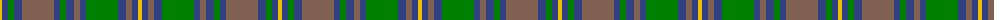

The parent of this is [Kerry](/tartans/y/4/b6/g6/b8/lt32/b6/g6/b8/lt6/b6/g32/b8/lt6/b6/y/4/)

This was sourced from weddslist.  It is a [15 stripes tartan](/stripes/stripes15/).

Original link http://www.weddslist.com/cgi-bin/tartans/pg.pl?source=sts

## Thread count
Y/4 B6 G6 B8 LT32 B6 G6 B8 LT6 B6 G32 B8 LT6 B6 Y/4

## Palette
Each colour and its ΔE from the base-6 reference it is a variant of.

| Colour | Shade | Base | ΔE (OKLab) |
|---|---|---|---|
| B |  `#304080` | B  | 0.01 |
| G |  `#008000` | G  | 0.09 |
| LT |  `#806050` | R  | 0.17 |
| Y |  `#F0C000` | Y  | 0.01 |

ID: /variants/y/4/b6/g6/b8/lt32/b6/g6/b8/lt6/b6/g32/b8/lt6/b6/y/4-b304080-g008000-lt806050-yf0c000/
