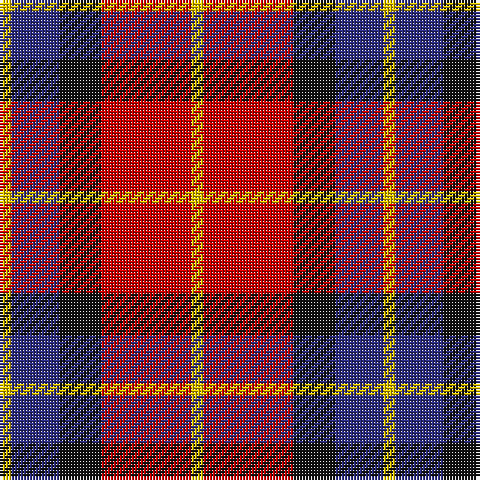

The parent of this is [Aberdeen University Corporate Tartan Tartan Number: 2152. Earliest known date: 1993 Aberdeen Unversity tartan was designed by the Weaver Incorporation of Aberdeen and Harry Lindley, to commemorate the Quincentennial of the University. The colours of the armourial bearings of the University were used as the starting point of the design, which was approved by the Principal in August 1992. See products available Copyright © Blair Urquhart, Comrie, 2015](/tartans/y/4/db16/k14/r30/y/4/)

This was sourced from house-of-tartan.  It is a [5 stripes tartan](/stripes/stripes5/).

Original link http://www.house-of-tartan.scotland.net/house/TartanViewjs.asp?colr=Def&tnam=2152

## Thread count
Y/4 DB16 K14 R30 Y/4

## Palette
Each colour and its ΔE from the base-6 reference it is a variant of.

| Colour | Shade | Base | ΔE (OKLab) |
|---|---|---|---|
| DB |  `#2C2C80` | B  | 0.05 |
| K |  `#101010` | K  | 0.17 |
| R |  `#C80000` | R  | 0.00 |
| Y |  `#E8C000` | Y  | 0.00 |

# Sample pattern

ID: /variants/y/4/db16/k14/r30/y/4-db2c2c80-k101010-rc80000-ye8c000/
