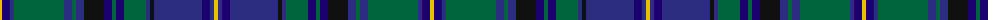

The parent of this is [LS Curling](/tartans/y/4/db8/dba4/g50/dba8/g4/dba8/k20/db8/g4/db8/g22/dba4/k4/dba48/db8/dba4/y/4/)

This was sourced from register-of-tartans.  It is a [18 stripes tartan](/stripes/stripes18/).

Original link https://www.tartanregister.gov.uk/tartanDetails.aspx?ref=2241

## Thread count
Y/4 DB8 DBa4 G50 DBa8 G4 DBa8 K20 DB8 G4 DB8 G22 DBa4 K4 DBa48 DB8 DBa4 Y/4

## Palette
Each colour and its ΔE from the base-6 reference it is a variant of.

| Colour | Shade | Base | ΔE (OKLab) |
|---|---|---|---|
| DB |  `#1C0070` | B  | 0.14 |
| DBa |  `#2C2C80` | B  | 0.05 |
| G |  `#00643C` | G  | 0.06 |
| K |  `#101010` | K  | 0.17 |
| Y |  `#E8C000` | Y  | 0.00 |

ID: /variants/y/4/db8/dba4/g50/dba8/g4/dba8/k20/db8/g4/db8/g22/dba4/k4/dba48/db8/dba4/y/4-db1c0070-dba2c2c80-g00643c-k101010-ye8c000/
