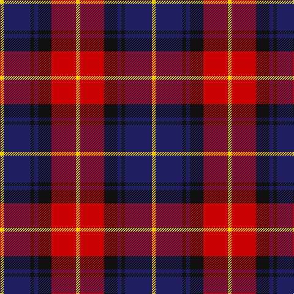

The parent of this is [Biffy Clyro](/tartans/y/6/db44/k6/db6/k22/r40/y/6/)

This was sourced from tartans-authority.  It is a [7 stripes tartan](/stripes/stripes7/).

Original link http://www.tartansauthority.com/tartan-ferret/display/11100/

## Thread count
Y/6 DB44 K6 DB6 K22 R40 Y/6

## Palette
Each colour and its ΔE from the base-6 reference it is a variant of.

| Colour | Shade | Base | ΔE (OKLab) |
|---|---|---|---|
| DB |  `#202060` | B  | 0.11 |
| K |  `#101010` | K  | 0.17 |
| R |  `#C80000` | R  | 0.00 |
| Y |  `#FCCC00` | Y  | 0.04 |

# Sample pattern

ID: /variants/y/6/db44/k6/db6/k22/r40/y/6-db202060-k101010-rc80000-yfccc00/
