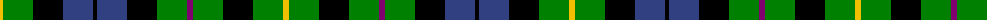

The parent of this is [MacBride](/tartans/y/6/g30/k30/b30/k4/b30/k30/g30/p6/g30/k30/g30/y/6/)

This was sourced from weddslist.  It is a [13 stripes tartan](/stripes/stripes13/).

Original link http://www.weddslist.com/cgi-bin/tartans/pg.pl?source=sts

## Thread count
Y/6 G30 K30 B30 K4 B30 K30 G30 P6 G30 K30 G30 Y/6

## Palette
Each colour and its ΔE from the base-6 reference it is a variant of.

| Colour | Shade | Base | ΔE (OKLab) |
|---|---|---|---|
| B |  `#304080` | B  | 0.01 |
| G |  `#008000` | G  | 0.09 |
| K |  `#000000` | K  | 0.00 |
| P |  `#800070` | B  | 0.17 |
| Y |  `#F0C000` | Y  | 0.01 |

ID: /variants/y/6/g30/k30/b30/k4/b30/k30/g30/p6/g30/k30/g30/y/6-b304080-g008000-k000000-p800070-yf0c000/
