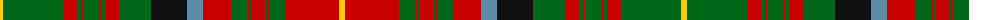

The parent of this is [Unidentified](/tartans/y/6/g60/r14/g4/r2/g16/r2/g4/r14/g32/k36/b16/r28/g16/r2/g2/r14/g2/r2/g16/r54/y/6/)

This was sourced from tartans-authority.  It is a [22 stripes tartan](/stripes/stripes22/).

Original link http://www.tartansauthority.com/tartan-ferret/display/8905/

## Thread count
Y/6 G60 R14 G4 R2 G16 R2 G4 R14 G32 K36 B16 R28 G16 R2 G2 R14 G2 R2 G16 R54 Y/6

## Palette
Each colour and its ΔE from the base-6 reference it is a variant of.

| Colour | Shade | Base | ΔE (OKLab) |
|---|---|---|---|
| B |  `#5C8CA8` | B  | 0.23 |
| G |  `#006818` | G  | 0.02 |
| K |  `#101010` | K  | 0.17 |
| R |  `#C80000` | R  | 0.00 |
| Y |  `#FCCC00` | Y  | 0.04 |

ID: /variants/y/6/g60/r14/g4/r2/g16/r2/g4/r14/g32/k36/b16/r28/g16/r2/g2/r14/g2/r2/g16/r54/y/6-b5c8ca8-g006818-k101010-rc80000-yfccc00/
