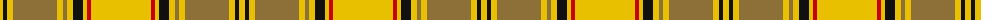

The parent of this is [Dunbarton (Quebec)](/tartans/y/6/k4/y6/lt44/y6/lt4/y6/k10/y4/r4/y/60/)

This was sourced from register-of-tartans.  It is a [11 stripes tartan](/stripes/stripes11/).

Original link https://www.tartanregister.gov.uk/tartanDetails.aspx?ref=1021

## Thread count
Y/6 K4 Y6 LT44 Y6 LT4 Y6 K10 Y4 R4 Y/60

## Palette
Each colour and its ΔE from the base-6 reference it is a variant of.

| Colour | Shade | Base | ΔE (OKLab) |
|---|---|---|---|
| K |  `#101010` | K  | 0.17 |
| LT |  `#8C7038` | G  | 0.18 |
| R |  `#C80000` | R  | 0.00 |
| Y |  `#E8C000` | Y  | 0.00 |

ID: /variants/y/6/k4/y6/lt44/y6/lt4/y6/k10/y4/r4/y/60-k101010-lt8c7038-rc80000-ye8c000/
