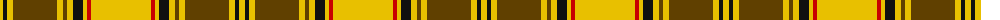

The parent of this is [Dunbarton Trade Tartan Tartan Number: 1886. Earliest known date: pre 2003 Dunbarton, Quebec. Different warp and weft See products available Copyright © Blair Urquhart, Comrie, 2015](/tartans/y/6/k4/y6/t44/y6/t4/y6/k10/y4/r4/y/60/)

This was sourced from house-of-tartan.  It is a [11 stripes tartan](/stripes/stripes11/).

Original link http://www.house-of-tartan.scotland.net/house/TartanViewjs.asp?colr=Def&tnam=1886

## Thread count
Y/6 K4 Y6 T44 Y6 T4 Y6 K10 Y4 R4 Y/60

## Palette
Each colour and its ΔE from the base-6 reference it is a variant of.

| Colour | Shade | Base | ΔE (OKLab) |
|---|---|---|---|
| B |  `#2888C4` | B  | 0.21 |
| K |  `#101010` | K  | 0.17 |
| R |  `#C80000` | R  | 0.00 |
| T |  `#604000` | G  | 0.14 |
| Y |  `#E8C000` | Y  | 0.00 |

ID: /variants/y/6/k4/y6/t44/y6/t4/y6/k10/y4/r4/y/60-b2888c4-k101010-rc80000-t604000-ye8c000/
