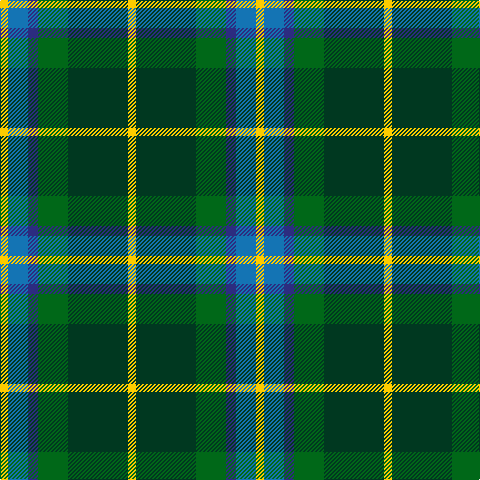

The parent of this is [MPS Emerald Society](/tartans/y/8/b20/db10/g30/dg60/y/8/)

This was sourced from tartans-authority.  It is a [6 stripes tartan](/stripes/stripes6/).

Original link http://www.tartansauthority.com/tartan-ferret/display/10711/

## Thread count
Y/8 B20 DB10 G30 DG60 Y/8

## Palette
Each colour and its ΔE from the base-6 reference it is a variant of.

| Colour | Shade | Base | ΔE (OKLab) |
|---|---|---|---|
| B |  `#1474B4` | B  | 0.15 |
| DB |  `#2C2C80` | B  | 0.05 |
| DG |  `#003820` | G  | 0.16 |
| G |  `#006818` | G  | 0.02 |
| Y |  `#FCCC00` | Y  | 0.04 |

# Sample pattern

ID: /variants/y/8/b20/db10/g30/dg60/y/8-b1474b4-db2c2c80-dg003820-g006818-yfccc00/
