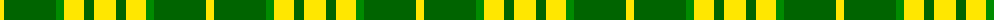

The parent of this is [North Dakota State University Bison](/tartans/y/8/g52/ga8/y20/g10/y/22/)

This was sourced from register-of-tartans.  It is a [6 stripes tartan](/stripes/stripes6/).

Original link https://www.tartanregister.gov.uk/tartanDetails.aspx?ref=10517

## Thread count
Y/8 G52 Ga8 Y20 G10 Y/22

## Palette
Each colour and its ΔE from the base-6 reference it is a variant of.

| Colour | Shade | Base | ΔE (OKLab) |
|---|---|---|---|
| G |  `#006400` | G  | 0.00 |
| Ga |  `#008B00` | G  | 0.12 |
| Y |  `#FFE700` | Y  | 0.11 |

# Sample pattern

ID: /variants/y/8/g52/ga8/y20/g10/y/22-g006400-ga008b00-yffe700/
