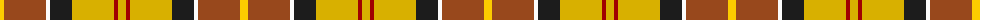

The parent of this is [Barbour - Muted](/tartans/y/8/t42/w4/k22/ya42/dr4/ya/8/)

This was sourced from tartans-authority.  It is a [7 stripes tartan](/stripes/stripes7/).

Original link http://www.tartansauthority.com/tartan-ferret/display/8735/

## Thread count
Y/8 T42 W4 K22 Ya42 DR4 Ya/8

## Palette
Each colour and its ΔE from the base-6 reference it is a variant of.

| Colour | Shade | Base | ΔE (OKLab) |
|---|---|---|---|
| DR |  `#A00000` | R  | 0.09 |
| K |  `#1C1C1C` | B  | 0.20 |
| T |  `#98481C` | R  | 0.11 |
| W |  `#FCFCFC` | W  | 0.03 |
| Y |  `#FCCC00` | Y  | 0.04 |
| Ya |  `#D8B000` | Y  | 0.05 |

# Sample pattern

ID: /variants/y/8/t42/w4/k22/ya42/dr4/ya/8-dra00000-k1c1c1c-t98481c-wfcfcfc-yfccc00-yad8b000/
