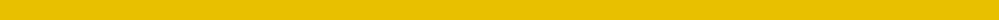

The parent of this is [Saffron Irish Family Tartan Tartan Number: 4078. Earliest known date: 1998 See products available Copyright © Blair Urquhart, Comrie, 2015](/tartans/ya/2/ya/2/)

This was sourced from house-of-tartan.  It is a [2 stripes tartan](/stripes/stripes2/).

Original link http://www.house-of-tartan.scotland.net/house/TartanViewjs.asp?colr=Def&tnam=4078

## Thread count
Ya/2 Ya/2

## Palette
Each colour and its ΔE from the base-6 reference it is a variant of.

| Colour | Shade | Base | ΔE (OKLab) |
|---|---|---|---|
| Y |  `#E8C000` | Y  | 0.00 |
| Ya |  `#E8C000` | Y  | 0.00 |

# Sample pattern

ID: /variants/ya/2/ya/2-ye8c000-yae8c000/
